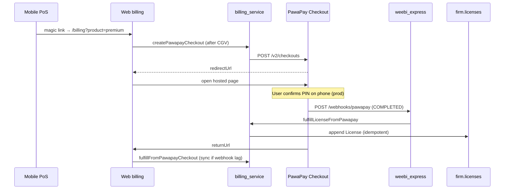

# PawaPay integration (mobile money licences)

Guidelines for collecting **one-time Weebi licence** payments (Premium, SYSCOHADA) via
[PawaPay](https://docs.pawapay.io/v2/docs/welcome), mirroring the existing Stripe Checkout
flow and the App → Web [magic-link bridge](../../weebi_client/webapp/docs/weebi_app_magic_link_bridge.md).

Weebi sells **lifetime licences**, not subscriptions. See
[`weebi_client/docs/commercial-model.md`](../../weebi_client/docs/commercial-model.md).

---

## Prerequisites (sandbox dashboard)

Do these in the [PawaPay sandbox dashboard](https://dashboard.sandbox.pawapay.io/)
**before** generating an API token. Callback configuration is a platform prerequisite;
the token alone is not enough to run an async payment flow.

### 1. Callback URL (required first)

PawaPay’s API is **asynchronous**. Final payment status is delivered by `POST` to a
callback URL you configure under **System configuration → Callback URLs**
([docs](https://docs.pawapay.io/dashboard/other/system_conf/callback_urls)).

Configure **at least Checkouts**. You may reuse the same URL for deposits / payouts /
refunds later.

| Environment                         | Callback URL to enter                            |
| ----------------------------------- | ------------------------------------------------ |
| **Dev / sandbox (target)**          | `https://express.dev.weebi.com/webhooks/pawapay` |
| **Production (later)**              | `https://express.prd.weebi.com/webhooks/pawapay` |
| **Local tunnel (while developing)** | `https://{your-tunnel-host}/webhooks/pawapay`    |

Hints:

- Path mirrors Stripe: Express already exposes `POST /webhooks/stripe`
  (`weebi_express` → `pkg/api/v1/router.go`). PawaPay should be a sibling route
  `POST /webhooks/pawapay` (not implemented yet).
- Use the **Express public base**, not the webapp / portal origin
  (`cloud.weebi.com`, `portal.weebi.com`, etc.). Callbacks are server-to-server.
- Must be **HTTPS** with a trusted CA certificate.
- Endpoint must accept unauthenticated `POST` and return **HTTP 200** quickly
  (PawaPay retries for ~15 minutes).
- Handler must be **idempotent** (same checkout completed twice → one licence).
- If you IP-filter inbound traffic, whitelist sandbox
  `3.64.89.224/32`
  ([what to know](https://docs.pawapay.io/v2/docs/what_to_know)).

Until the Express handler exists, you can still **save** the callback URL in the
dashboard (prerequisite for a complete sandbox setup). Point a tunnel at a stub that
returns `200` if you need to observe payloads early.

### 2. Then: API token

After the callback URL is set (or at least decided):

1. Generate a sandbox API token (Technical Administration role).
2. Store it only in env / secret manager — never in git.

| Env var                | Example                          |
| ---------------------- | -------------------------------- |
| `PAWAPAY_API_BASE_URL` | `https://api.sandbox.pawapay.io` |
| `PAWAPAY_API_TOKEN`    | *(sandbox bearer token)*         |

Live later: `https://api.pawapay.io` + a **new** production token
([how to start](https://docs.pawapay.io/v2/docs/how_to_start)).

### 3. Confirm deposits are enabled

Checkout initiation fails with `DEPOSITS_NOT_ALLOWED` if deposits are not enabled on
the merchant account for the providers you need.

---

## Two different URLs (do not confuse)

| URL                                    | Where                               | Role                                                                     |
| -------------------------------------- | ----------------------------------- | ------------------------------------------------------------------------ |
| **Callback URL** (dashboard)           | `weebi_express` `/webhooks/pawapay` | Server notification of final status (`COMPLETED` / `FAILED` / `EXPIRED`) |
| **`returnUrl`** (per checkout request) | Webapp hash route                   | Browser return after hosted page — **not** proof of payment              |

Suggested browser return (when implementing):

```text
{WEBAPP_ORIGIN}/#/billing?success=true&provider=pawapay&checkout_id={checkoutId}
```

Never grant a licence from `returnUrl` alone. Always fulfill from the **checkout
callback** and/or `Check checkout status`
([checkout callback](https://docs.pawapay.io/v2/api-reference/checkouts/checkout-callback)).

---

## Which PawaPay product (v1)

Use **Checkouts** (`POST /v2/checkouts` → `redirectUrl`): closest to Stripe Checkout.

| Product        | v1?            | Notes                                                               |
| -------------- | -------------- | ------------------------------------------------------------------- |
| **Checkouts**  | Yes            | Hosted page, retries, FR/EN, fixed amounts per country              |
| Deposits (raw) | Optional later | More custom UX                                                      |
| Payment page   | Skip           | Overlaps Checkouts                                                  |
| Payouts        | Phase 2        | Referral cashout (“Stripe or Pawapay” already mentioned in billing) |
| Refunds        | Phase 2        | Support ops                                                         |

Docs: [Initiate checkout](https://docs.pawapay.io/v2/api-reference/checkouts/initiate-checkout) ·
[Checkouts guide](https://docs.pawapay.io/v2/docs/checkouts) ·
[Sandbox test numbers](https://docs.pawapay.io/v2/docs/test_numbers).

---

## Reuse the Stripe + magic-link shape

| Concern       | Stripe today                              | PawaPay target                                                        |
| ------------- | ----------------------------------------- | --------------------------------------------------------------------- |
| Start pay     | `createCheckoutSession` → Stripe          | `createPawapayCheckout` → PawaPay Checkouts                           |
| UI            | Web billing (+ magic link from mobile)    | Same; add “Mobile money”                                              |
| Webhook       | Express `POST /webhooks/stripe`           | Express `POST /webhooks/pawapay`                                      |
| Sync fallback | `fulfillFromStripeCheckoutSession`        | `fulfillFromPawapayCheckout`                                          |
| Licence       | `PAYMENT_PROVIDER_STRIPE`, `lic_stripe_…` | `PAYMENT_PROVIDER_PAWAPAY` (proto exists), `lic_pawapay_{checkoutId}` |

### Proto surface (v1.3.8+)

Already in `license.proto` / firm:

- `PaymentProvider.PAYMENT_PROVIDER_PAWAPAY`
- `BillingProduct.pawapayProductId`
- `Firm.providerCustomerIds["pawapay"]`

Billing RPCs / messages in `billing_service.proto`:

| RPC                          | Role                                              |
| ---------------------------- | ------------------------------------------------- |
| `createPawapayCheckout`      | Client → hosted `redirectUrl` + `checkoutId`      |
| `fulfillLicenseFromPawapay`  | Express webhook → grant licence (service account) |
| `fulfillFromPawapayCheckout` | Client returnUrl sync fulfill                     |

Also: `AccountingYearPurchase.pawapayCheckoutId` + `paymentProvider`.

Server stubs currently throw `UNIMPLEMENTED` until the PawaPay client is wired.

**Magic link** stays payment-agnostic: mobile → `/?t=…#/bridge` → `/#/billing?product=…`
→ CGV → **Stripe or PawaPay**. See
`weebi_client/webapp/docs/weebi_app_magic_link_bridge.md`.



---

## Implementation notes (when coding)

### Catalog / money

- Mongo `billing_products` is the **single source of truth**.
- Stripe: `amountCents` + `currency` (EUR) + `stripePriceId` / `stripeProductId`.
- PawaPay: **`pawapayAmounts`** map of ISO 4217 → minor units (fixed list prices, **no live FX**), e.g.

```js
pawapayAmounts: { XOF: 9900, XAF: 9900, CDF: 39900 }  // premium
```

- Seed / refresh PawaPay amounts without touching Stripe:

```bash
cd packages/billing_service
dart run tool/seed_pawapay_amounts.dart "$MONGO_DB_URI"
```

- `create_stripe_products.dart` also writes `pawapayAmounts` on new rows.
- `pawapayProductId` may stay empty (internal SKU only). PawaPay has no Stripe Price IDs; amounts are sent on `POST /v2/checkouts`.
- Referral: buyer 10% discount applies to the **PawaPay catalog amount** charged; referrer 20% commission still uses EUR `amountCents`.

### `billing_service`

- Generate UUIDv4 `checkoutId` **before** the API call; persist pending intent
  (`firmId`, `productId`, `fiscalYear?`, terms version).
- Put the same metadata Stripe uses: `firmId`, `productKind`, `fiscalYear`,
  `legalTermsVersionDate`.
- Fulfill only on checkout status **`COMPLETED`**.
- Reuse the Stripe licence / SYSCOHADA write path; only provider + external id differ.

### `weebi_express`

- Clone the Stripe webhook pattern (`stripe_webhook_handler.go`): parse → idempotent
  gRPC fulfill → confirmation email + audience.
- Ack `FAILED` / `EXPIRED` without granting.
- Optionally verify [signed callbacks](https://docs.pawapay.io/v2/docs/signatures) once stable.

### Webapp

- After CGV: **Card (Stripe)** | **Mobile money (PawaPay)**.
- On return with `checkout_id`, sync-fulfill if the webhook lagged.
- Mobile: keep “waiting for payment” + refresh licences (magic-link doc).

---

## Phased plan

1. **Sandbox ops** — callback URL (above) → API token → Postman happy path  
2. ~~**Express** — `POST /webhooks/pawapay`~~ **done** (mocked gRPC TDD)  
3. ~~**billing_service** — create / fulfill~~ **done** (FakePawapay + MockClient TDD; Premium + SYSCOHADA)  
4. ~~**Web UI** — Card vs Mobile money + return sync~~ **done** (`billing_screen.dart`)  
5. **Deploy + sandbox e2e** — env vars, callback URL, test MSISDNs  
6. **Hardening** — signed callbacks, provider availability  
7. **Go live** — prod dashboard, new token, prod callback URL, IP allowlist
   ([going live](https://docs.pawapay.io/v2/docs/going_live))  
8. **Later** — payouts (referrals), refunds  

### Landed in code (TDD)

**weebi_express**

- `POST /webhooks/pawapay` → fulfill on `COMPLETED`, ack `FAILED`/`EXPIRED`
- Tests: `pkg/api/v1/handlers/pawapay_webhook_handler_test.go` (mocked gRPC)
- Deduper: `internal/pawapayreceipt`
- Env (optional on Express): `PAWAPAY_API_BASE_URL`, `PAWAPAY_API_TOKEN`
- Bump Express `.protos-version` to **1.3.8** and ensure `pkg/proto` includes PawaPay RPCs

**weebi_server / billing_service**

- Injectable `PawapayCheckoutClient` + `FakePawapayCheckoutClient` / `PawapayHttpCheckoutClient` (`MockClient` tests)
- RPCs implemented: `createPawapayCheckout`, `fulfillLicenseFromPawapay`, `fulfillFromPawapayCheckout`
- XOF list prices (v1): Premium **9900** (14 EUR), SYSCOHADA **1900** (aligned with marketing FCFA)
- Country: firm → chain → boutique waterfall (alpha-2), converted to ISO-3 for PawaPay;
  single `countries` / `amounts` entry (XOF/XAF only in v1)
- Env: `PAWAPAY_API_BASE_URL`, `PAWAPAY_API_TOKEN`
- Tests: `test/pawapay_checkout_test.dart`, `test/pawapay_billing_rpc_test.dart`

---

## Sandbox checklist

- [ ] Decide callback URL (`https://express.dev.weebi.com/webhooks/pawapay` or tunnel)
- [ ] Enter it in sandbox dashboard (**Checkouts** at minimum) — **before** relying on the token for end-to-end tests
- [ ] Generate sandbox API token; store in secrets (`PAWAPAY_*` on **server**; Express needs deploy of webhook route)
- [ ] Whitelist `3.64.89.224/32` if needed
- [ ] Confirm deposits enabled for target providers
- [ ] Postman or portal: initiate checkout → [test MSISDN](https://docs.pawapay.io/v2/docs/test_numbers) → callback `COMPLETED`
- [x] Decide v1 countries / currencies — XOF corridor (`CIV`, `SEN`, …) with fixed FCFA amounts
- [x] Add env vars alongside existing `STRIPE_*` / `STRIPE_WEBHOOK_SECRET`

---

## Design principles (from Stripe)

1. Webhook is source of truth; browser return is UX + sync fallback.  
2. Idempotent fulfill on provider payment id (`checkoutId`).  
3. Terms (CGV) before money.  
4. Provider-agnostic entitlements — only `paymentProvider` + external id differ.  
5. Magic link = auth handoff, not a second payment stack.  
6. Sandbox + fake MSISDNs before production onboarding.
