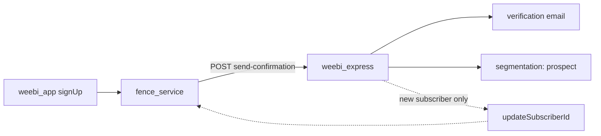
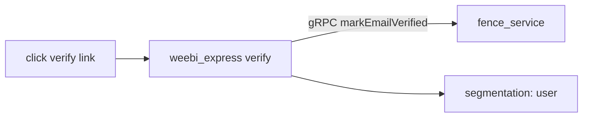
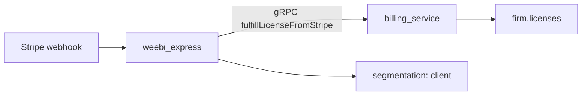

# Subscription & newsletter audience

Two separate concerns — do not conflate them:

| Concern | Owner | Stores |
|---------|-------|--------|
| **Account & newsletter audience** | `fence_service` + `weebi_express` | user + `subscriber.segmentation` |
| **License / billing** | `billing_service` (+ Stripe webhook via express) | `firm.licenses` |

Join key: **email**. Optional back-link: `user.subscriberId` → express subscriber `_id`.

Audience segments (lifecycle): `prospect` → `user` → `client`.

---

## 1. Account signup (newsletter only)

Self-registration in the app. No license involved.

Triggered by `_sendConfirmationEmailAsync` in `signUp` (`fence_service_base.dart`). Requires `WEEBI_EXPRESS_BASE_URL`.

---

## 2. Email verification (newsletter + user flag)

User clicks the link in the confirmation email.

---

## 3. License acquisition (billing only)

Stripe checkout. Writes the license; audience upgrade is a side effect in express, not in `billing_service`.

Client redirect `fulfillFromStripeCheckoutSession` also creates the license but **does not** update segmentation — rely on the webhook above.

---

## fence_service → weebi_express (HTTP)

JWT via `WEEBI_EXPRESS_JWT_SECRET_KEY` / `AppEnvironment`.

| Trigger | Endpoint | Audience |
|---------|----------|----------|
| `signUp` | `POST /api/v1/emails/send-confirmation` | `prospect` |
| `requestPasswordReset` | `POST /api/v1/emails/send-password-reset` | — |

## Notes

- **`createPendingUser`**: no confirmation email yet — no automatic newsletter entry on invite alone.
- **`WEEBI_EXPRESS_BASE_URL` unset**: signup succeeds; email + `prospect` sync skipped (warning logged).

Refs: [`fence_service_base.dart`](../packages/fence_service/lib/src/fence_service_base.dart), [`weebi_express` README](../../weebi_express/README.md).
