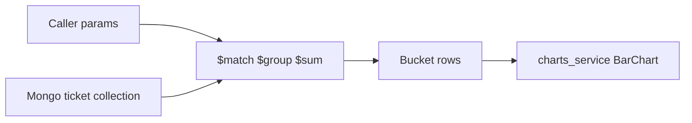

# Ticket-first chart aggregation (Mongo), closings later

## North star vs what we build now

**End target:** clean financial reports that combine **tickets** and **closings** (`ClosingLedgerBoutique` → `ReportFinancialBoutique` → `FinFlow`).

**Phase 1 (low-hanging fruit):** stay **ticket-only**, **aggregate in Mongo**, do **not** go deep on closings, caching tiers, or full report plumbing yet. Optimize for aggregation and charts that look like the business.

**Later:** feed the same bucket rows into closing-shaped models and `ReportFinancialBoutique` without loading raw tickets.

---

## Caller contract (keep it small)

The entry point accepts:

| Parameter | Role |
| --- | --- |
| **`boutiqueIds`** | `List<String>` — one or many boutiques; Mongo `$match` on `boutiqueId` with `$in` |
| **`timeRange`** | Inclusive business window on **`ticket.date`** (active tickets only) |
| **`timePeriod`** | Bucket size for the x-axis: day / week / month |
| **`chartMetric`** | Which ticket types and amounts to roll into one series per bucket |

### `FinancialChartMetric` presets

| Metric | Ticket types | Amount |
| --- | --- | --- |
| **Cashflow income** | `sell`, `sellCovered` | sell → `sell_totals.markdownsAndTaxIncluded`; covered → `received` |
| **Cashflow spending** | `spend`, `spendCovered` | spend → `spend_totals.markdownsAndTaxIncluded`; covered → `received` |
| **All income** | `sell`, `sellCovered`, `sellDeferred` | same amount rules per type |
| **All spending** | `spend`, `spendCovered`, `spendDeferred` | same amount rules per type |

**Filters (P0):** `ticket.status == true`, exclude `isDeleted`, scope `firmId` from auth/context. **Wage**, stock types, and payment breakdown are **out of scope** for this slice.

**Multi-boutique:** default **one combined series** (sum across all `boutiqueIds` per bucket).

---

## Mongo

- **Collection:** `ticket`
- **Document shape:** `TicketMongo` — filter on envelope `boutiqueId`, `firmId`; read nested `ticket.*` for date, type, status, totals.
- **Pipeline sketch:** `$match` → period key from `ticket.date` → `$group` with conditional `$sum` on type and stored totals → `$sort`.

Prefer **stored totals** on the document when present; avoid re-implementing promo/tax math in the pipeline beyond simple `$cond` / `$ifNull`.

---

## Chart layer (`charts_service`)

- **No business rules in SVG code** — `BarChart` only receives time-series rows.
- **Adapter:** map each aggregation row → `xTime` + `yValue`; set `timeGranularity` from `timePeriod`.
- **Demo:** `bin/main.dart` parameterized run writing SVG files per `FinancialChartMetric`.

---

## Explicitly deferred

- `ClosingLedgerBoutique` and `sumClosings` in `FinFlow`.
- `ReportFinancialBoutique` / `charts_weebi` Flutter frames.
- Proto-first offline fixtures without Mongo.
- Operational cache, rate limits, persisted monthly closings.
- Payment-type pies, wage, stock analytics.

---

## Implementation order

1. `FinancialChartMetric` + query DTO.
2. Mongo pipeline for metrics and daily buckets; generalize period + metric switch.
3. Row → `BarChart` adapter + `bin/main.dart` SVG output.
4. Tests on metric membership and amounts.
5. Follow-up: closing-shaped rows + `ReportFinancialBoutique`.
